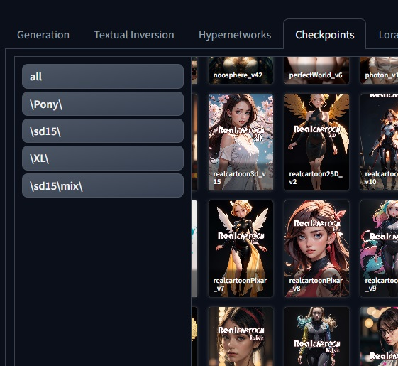

# SD WebUI Network Cards

Custom CSS style for [AUTOMATIC1111/stable-diffusion-webui](https://github.com/AUTOMATIC1111/stable-diffusion-webui.git) extra networks tab. 




## Install

* Open the `Extensions` tab and navigate to `Install from URL`.
* Paste the repository URL into the `URL for extension's git repository` field:  
    ```
        https://github.com/bandifiu/sd-webui-network-cards.git
    ```    

* Press the `Install` button.    
* Restart the WebUI using `Reload UI` button